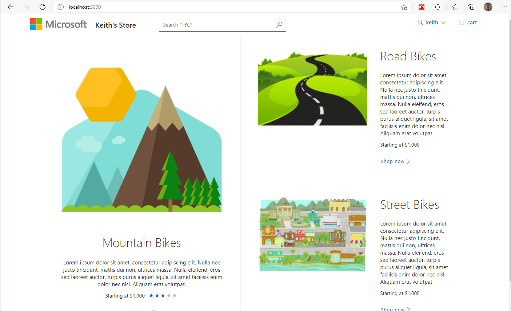

# Cloud Native - Azure Example Application 

 _Work in progress_

Ecommerce - Example application highlighting the following architectural patterns

 :heavy_check_mark:  Cloud agnostic, open-source, open-protocols  
 :heavy_check_mark:  Server-side rendering with React18 for site performance and SEO  
 :heavy_check_mark:  Microservices with CRUD and Event Sourcing patterns  
 :heavy_check_mark:  Cloud provider SLA backed Messaging, Persistance, Identity, and Analytics services  
 :heavy_check_mark:  Complete with devops toolchain, real-time Monitoring and analytics  
  

### Example frontpage



## Target Architecture

### High level Application Architecture


## Build and run - local dev laptop (Linux, Mac or WSL2)

### Requirements
npm version >=8 (uses mono-repo workspaces dependencies)
nodejs >= 16 

### MongoDB

Install and run mongo using a replicaset.  A _replica set_ in MongoDB is a group of mongod processes that maintain a syncronised copy of the same data set to provide redundancy and high availability  Replicasets are required to allow the programmer to use the _Change Streams_ feature.

One member is deemed the _primary node_, receiving all write operations, while the other nodes are deemed secondary nodes.  The secondaries replicate the primary’s oplog and apply the operations to their data sets such that the secondaries’ data sets reflect the primary’s data set.  When a primary does not communicate with the other members for 10seconds, an eligible secondary calls for an election to nominate itself as the new primary

Start:

If using Docker:

```
docker volume create --name=mongodata
# a Replica Set single instance
docker run --restart always --name mongo_dev -v mongodata:/data/db -d -p 27017:27017 mongo --replSet rs0
```
else

```
mkdir __mongo_data__
nohup mongod --replSet rs0  --dbpath ./__mongo_data__/ &
```

NOTE: First time only, run to setup the replicaset:
```
mongo --eval 'rs.initiate({ _id: "rs0", members: [ { _id: 0, host : "localhost:27017" }]})'
```


### Build and run the app

Clone the repo locally, and from the project root directory, build the project
```
sh ./workflows/dev.1.build.sh
```

Create a local environment file `./env_local` and populate with the required environment variables to run the microservices services locally:


  ```
  #  Variables for the local azurite blob storage service
  STORAGE_ACCOUNT="devstoreaccount1"
  STORAGE_CONTAINER="az-shop-images"
  STORAGE_MASTER_KEY="Eby8vdM02xNOcqFlqUwJPLlmEtlCDXJ1OUzFT50uSRZ6IFsuFq2UVErCz4I6tq/K1SZFPTOtr/KBHBeksoGMGw=="
  #  Variables for the local mongodb
  MONGO_DB="mongodb://localhost:27017/dbdev?replicaSet=rs0"
  USE_COSMOS="false"
  ```

Now launch the microservices using the node process manager `pm2`


NOTE: First time only, run to create the storage container:

    ```
    # Mkdir for `azurite` storage local emulator
    mkdir ./__blobstorage__
    # Start azurity only
    npx pm2 start ./pm2.config.js --only blob
    # Wait for azurite to launch, then create container
    sleep 2
    az storage container create --connection-string "DefaultEndpointsProtocol=http;AccountName=devstoreaccount1;AccountKey=Eby8vdM02xNOcqFlqUwJPLlmEtlCDXJ1OUzFT50uSRZ6IFsuFq2UVErCz4I6tq/K1SZFPTOtr/KBHBeksoGMGw==;BlobEndpoint=http://127.0.0.1:10000/devstoreaccount1;" -n az-shop-images
    ```

All other times:

```
npx pm2 start ./pm2.config.js
```

See logs:

```
npx pm2 logs
```

Navigate to `http://localhost:3000` and you should see the start page

To ensure all the services are started correctly, run the `playwright` test script

```
npx playwright test
```


## Cloud Deployment Instructions

NOTE: Requires 'az' cli, authenitcated with a user with subscription ownership permissions

### Provisioning a cluster

This script uses the [AKS helper](https://azure.github.io/Aks-Construction) template to provision your cluster.  The helper was configured with the followiong settings:


NOTE: Requires a Azure DNS Zone resource, to expose secure public endpoint on custom domain

```
bash ./workflows/az.1.aks.sh -n < aks-name > -z <Azure DNS Zone Resource Id> -e <email>
```

###  Provision the Application dependencies


```
bash ./workflows/az.2.dependencies.sh < app name > > ./.env.azure
cat ./.env_azure_prereqs >> ./.env.azure
```


## Deploy App to Azure

```
bash ./workflows/az.3.buildDeploy.sh < aks-name > 
```


# Link to B2C

Unfortunatly, Azure AD B2C cannot be provisioned using automation, so follow these manual steps:

1. Create a B2C Tenent (using portal at https://portal.azure.com)

```
B2C_TENANT="<my_b2c_name_exclude_domain>"
```

2. Register a B2C App, select
 * Account Type: Accounts in any identity provider or organizational directory
 * Redirect URI : <Web> ${APP_HOST_URL}/connect/microsoft/callback
 
```
B2C_CLIENT_ID="<value>"
```

3. In the App 'Certificates & Secrets', create a new Client secret
```
B2C_CLIENT_SECRET="<value>"
```

4. Create the login and signup flow
 * Add Identity Providers as required ('Google' and 'Facebook')
 * Create a new Sign up and Signin Flow

```
B2C_SIGNIN_POLICY="<value>"
B2C_RESETPWD_POLICY="<value>"
```

NOTE: if developing locally, place values in local .env file
```
```


## Design Rationals

### Mono-repo

This project is a tracked in a `mono-repo`, it uses vscode [multi-workspace](https://code.visualstudio.com/docs/editor/multi-root-workspacese) to organise the project into services using sub-folders.  When opening the project in vscode, ensure you use the `workspace.code-workspace` file


### Serivces Coupling

Questions:

Can independent services share a collection definition?  This is an antipattern for shared dependencies?
Can services call other services syncronously?  This is a antipattern for building reliable systems?
Can differnet services 'master' specific fields on a collection?


### Data Persistance

The Design of the application is highly influenced by the choice of the features of the chosen data persistance service, in this case, CosmosDB/Mongodb.

### Resilience

Infrastructure is unreliable, kubernetes services may move around.  Our services need to:
 * Be able to be interrupted & restarted without introducing inconsistancies, this means all methods need to be itempotent
 
No-SQL operations are not transational, and any operations can potentially be throttled, or be effected by transient service outages, Our services need to:
 * Use single CosmosDB operations per user-interaction when possible, if more that one operation is needed that mutates data, ensure itempotency
 * Any complex processing that needs to take place based on a user-interaction needs to be decoupled from the user-interaction, and a async method up updating the user as to the outcome of that processing.


### Partition Rational

Items in a container are divided into distinct subsets called __logical partitions__ based on the value of a partition key, 1 logical partition per distinct partition key value.  __partition keys__ are immutable  
The high volume data in the sotution is transational or telemetry data, each is assosiated with a user, and potentally a device.  The partition key needs to be related to the hierarchy of the user, or the device for maxiumu data distribution

